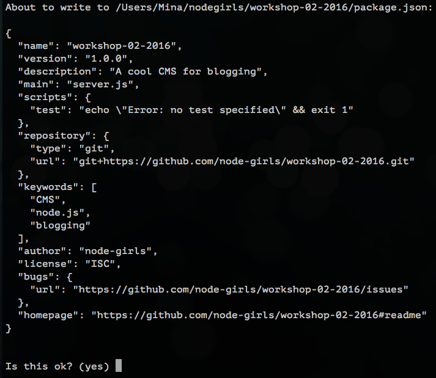

# Step 1 - Setting up your project

When creating a Node.js project, you will be installing a lot of different things along the way. If you want to share your project with others, you need to have a list of the things you installed, so that other people know what to install in order to run the project.

In Node.js, this 'list' file is called a `package.json`. The 'things you've installed' are referred to as **dependencies**. Creating this file is the first step in setting up your Node.js project.

## 1. Make a `package.json` file

Let's start by creating the `package.json` file. The `package.json` file is easy to create from the command line. Type the following command into your terminal to get started:

```bash
$ npm init
```

This command will initialise a step-by-step process for creating the `package.json`. You should see something like this:


It will ask you the following questions:

#### `name`
* npm suggests a default name for your project in brackets. If you want to give it your own name, just type it next to the brackets and press `Enter`.
* If you're happy with the name in brackets, simply press `Enter`.

#### `version`
* This is your first project, so it will be version 1.0.0! Nothing to change here, so just press `Enter`.

#### `description`
* A simple description of your project. Write whatever you want and press `Enter`.

#### `entry point`
* This file will be the starting point for your whole project.
* Let's change this from `(index.js)` to `server.js`, as we will be building a server later on!
* Type `server.js` and press `Enter`.

#### `test command`
* Skip this one for now...press `Enter`.

#### `git repository`
* This is where your project would live on GitHub.  Press `Enter`.

#### `keywords`
* (Optional) You can add keywords to help people find your project if they search for it.

#### `author`
* It's your project, so write your name! You can use your GitHub name or your actual name.

#### `license`
* You can add a license, but we'll skip this.

You will see a confirmation of your `package.json`. If you're happy with it, press `Enter` to finalise its creation.



Great! You should now see a new file called `package.json` in your project's folder.

### [Go to Step 2 >>>>](step02.md)

## Keywords

| Keyword | Explanation |
|--------|:-------------------------------:|
| `package.json` | A `package.json` is the file used to store information about a Node.js project, such as its name and its dependencies. Read more [here](http://browsenpm.org/package.json). |
| npm | npm is a "package manager" for Node.js, meaning it allows you to easily install external modules (or chunks of code) published by others and use them in your project. |
| dependencies | Dependencies are external code modules that are required to run your project. |
