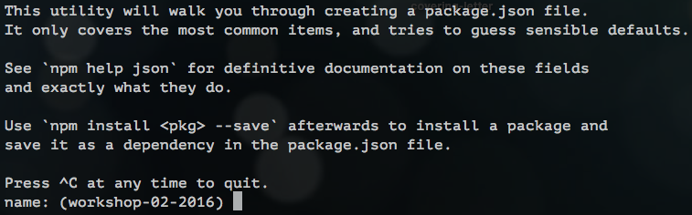

# Step 1 - Set up your first project

Often when creating a project, you might be installing lots of different things along the way.

If you wish to share your project with others, it would be useful to have a list of the things you installed in one file, so that other people's machines know what to install, in order to run it.

This 'list' file is called a `package.json`.  The 'things you've installed' are referred to as **npm packages**

## 1. Make a `package.json` file

Let's start by creating the package.json now.  Then we can add things to it as the project grows.

Type the following command to start creating the `package.json`:

```
npm init
```
This initialises a step-by-step process to putting the `package.json` together.

You should see this:


`name`
* npm suggests a default name for your project in brackets.  If you want to give it your own name, just type it next to the brackets and press `Enter`.
* If you're happy with the name in brackets, simply press `Enter`.

`version`
* This is your first project, so it will be version 1.0.0!  Nothing to change here, so press `Enter`.

`description`
* A simple description of your project.  Write whatever you want and press `Enter`.

`entry point`
* This file will be the starting point for your whole project.
* Let's change this from `(index.js)` to `server.js`, as we will be building a server later on!
* Type `server.js` and press `Enter`.

`test command`
* Skip this one for now... press `Enter`.

`git repository`
* This is where your project would live on GitHub.  Press `Enter`.

`keywords`
* (Optional) You can add keywords to help people find your project if they search for it.

`author`
* It's your project, so write your name!  You can use your GitHub name or your actual name.

`license`
* You can add a license, but we'll skip this.

You will see a confirmation of your `package.json`.  If you're happy with it, press `Enter` to finish making it.

Don't worry if you've made a mistake, your mentor can help you.


Great!  You should now see a new file called `package.json`.

## [**next step >>>**](step02.md)
---
## Keywords
* [`package.json`](https://docs.npmjs.com/getting-started/using-a-package.json)
* [`npm`](https://docs.npmjs.com/getting-started/what-is-npm)
* [`npm packages`](https://docs.npmjs.com/getting-started/installing-npm-packages-locally)
